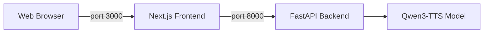

<p align="center">
  <h1 align="center">🦜 Parrot AI - Voice Cloning</h1>
  <p align="center"><strong>If you can hear it, we can clone it.</strong></p>
  <p align="center">
    <a href="#-features">Features</a> •
    <a href="#️-architecture">Architecture</a> •
    <a href="#-installation">Installation</a> •
    <a href="#-usage">Usage</a>
  </p>
</p>

---

A powerful voice cloning application powered by **Qwen3-TTS-12Hz-1.7B-Base**. Upload a short voice sample (5-10 seconds) and generate natural-sounding speech in that voice.

This repository holds the **Python backend** — the FastAPI inference server, a standalone Gradio app, and the marketing site. The React frontend lives in its own repository (see [Architecture](#️-architecture)).

## ✨ Features

- **🎯 High-Quality Voice Cloning** - Clone any voice from just 5-10 seconds of audio
- **⚡ GPU Accelerated** - Runs on CUDA for fast inference
- **🎙️ Dual Input Modes** - Record via microphone or upload audio files
- **📝 Optional Transcript** - Provide transcript for even better voice matching. Leave it blank and the reference is embedded in **x-vector-only mode**; supply one and the model gets the full transcript-conditioned prompt
- **✍️ Auto-Transcription** - OpenAI **Whisper** (`base`) transcribes the reference clip for you via `/api/transcribe`
- **🗂️ Saved Voice Library** - Name and store a voice once; its speaker embedding is cached to disk (`.pt`) and its metadata to SQLite, so later generations skip re-embedding
- **🎨 Three Models, Hot-Swappable** - Voice cloning (Base), prompt-described voices (VoiceDesign) and built-in preset speakers (CustomVoice), switched at runtime with the old weights unloaded and VRAM freed
- **📖 Long-Form Batching** - Text longer than 500 characters is split on sentence boundaries, generated chunk by chunk and stitched back together
- **🎭 Multi-Speaker Dialogue** - Render a scripted conversation into one WAV, mixing cloned and preset speakers, with 0.3s of silence between turns
- **📡 Streaming Progress** - `/api/generate-stream` reports staged progress over SSE instead of leaving the UI blank
- **🎛️ Sampling Controls** - `temperature`, `top_p`, `top_k` and `repetition_penalty` are exposed per request
- **🌐 Web Interface** - Modern Next.js React UI accessible from any browser

## 🏗️ Architecture

This project uses a split architecture:

- **Backend (Port 8000)**: Python/FastAPI server hosting the Qwen3-TTS model.
- **Frontend (Port 3000)**: Next.js React application for the user interface.

> **Note:** The frontend code is maintained in a separate repository: [parrot-ai-frontend-qwen](https://github.com/GODOSTROYER/parrot-ai-frontend-qwen)



### Two Ways to Run It

The repository ships two independent entry points against the same model:

| File | Serves | Port | Use it for |
| ---- | ------ | ---- | ---------- |
| `backend.py` | FastAPI JSON/SSE API for the Next.js frontend | 8000 | The full app — saved voices, dialogue, model switching. This is what `run.bat` starts. |
| `app.py` | Self-contained Gradio UI | 7860 | A quick local demo with no Node.js and no frontend repo. Cloning only. |

`website/` is a separate static landing page (plain HTML/CSS/JS, no build step) — open `website/index.html` directly. Its call-to-action links to the Gradio app on `http://localhost:7860`.

### Models

`backend.py` maps three Qwen3-TTS checkpoints and loads **Base** at startup:

| Key | Checkpoint | Purpose |
| --- | ---------- | ------- |
| `base` | [`Qwen/Qwen3-TTS-12Hz-1.7B-Base`](https://huggingface.co/Qwen/Qwen3-TTS-12Hz-1.7B-Base) | Clone a voice from reference audio |
| `design` | [`Qwen/Qwen3-TTS-12Hz-1.7B-VoiceDesign`](https://huggingface.co/Qwen/Qwen3-TTS-12Hz-1.7B-VoiceDesign) | Build a voice from a written description |
| `custom` | [`Qwen/Qwen3-TTS-12Hz-1.7B-CustomVoice`](https://huggingface.co/Qwen/Qwen3-TTS-12Hz-1.7B-CustomVoice) | Generate with built-in preset speakers |

A singleton `ModelManager` holds exactly one at a time. Switching deletes the current model, calls `torch.cuda.empty_cache()` and runs `gc.collect()` before loading the next — so peak VRAM stays at one model's footprint, but a switch costs a full reload. Weights are pulled from Hugging Face on first use and cached there; nothing is vendored in this repository. Inference runs in `float16` on CUDA and falls back to `float32` on CPU.

### Generation Flow

1. The reference clip arrives as an upload or a `voice_id` from the saved library.
2. Audio is decoded and resampled to 16 kHz mono.
3. A voice-clone prompt is built — with `ref_text` when a transcript is available, otherwise `x_vector_only_mode=True`.
4. The text is split into ≤500-character chunks on sentence boundaries.
5. Each chunk is generated in a worker thread (`language="Auto"`) so the event loop stays responsive.
6. Chunks are concatenated and written to a WAV buffer, returned either as a download or as base64 inside the final SSE event.

## 📋 Prerequisites

Before installing, ensure you have:

| Requirement  | Version   | Notes                          |
| ------------ | --------- | ------------------------------ |
| **Python**   | 3.10+     | Tested with 3.12               |
| **Node.js**  | 18+       | Required for frontend          |
| **CUDA GPU** | 8GB+ VRAM | RTX 3060 or better recommended |
| **PyTorch**  | 2.0+      | With CUDA support              |
| **SoX**      | 14.4.2+   | Audio processing library       |

### Installing SoX (Windows)

1. Download from: https://sourceforge.net/projects/sox/files/sox/
2. Install to `C:\Program Files\sox-14.4.2`
3. Add to PATH or use the provided `run.bat` (backend only)

## 🚀 Installation

### 1. Clone the Repository

```bash
git clone https://github.com/GODOSTROYER/Voice-Cloner-Qwen-Arnav.git
cd Voice-Cloner-Qwen-Arnav
```

### 2. Backend Installation

Set up the Python environment for the API server.

```bash
# Create virtual environment
python -m venv .venv

# Activate (Windows)
.venv\Scripts\activate

# Install PyTorch with CUDA (Adjust for your version)
pip install torch torchvision torchaudio --index-url https://download.pytorch.org/whl/cu121

# Install dependencies
pip install -r requirements.txt

# The API server additionally needs these (requirements.txt covers app.py's Gradio path)
pip install fastapi "uvicorn[standard]" python-multipart openai-whisper
```

> `requirements.txt` lists the model and audio stack — `qwen-tts`, `gradio`, `transformers`, `accelerate`, `soundfile`, `librosa`, `numpy`, `einops`, `sox`, `onnxruntime` — and assumes PyTorch is already installed. `backend.py` imports FastAPI, Whisper and multipart form handling on top of that, so install the extra line above before starting the API server. `app.py` (Gradio) runs on `requirements.txt` alone.

Optionally, Flash Attention 2 can be installed for faster inference:

```bash
pip install flash-attn --no-build-isolation
```

### 3. Frontend Installation

The web interface is a **separate repository**. Clone it next to this one and install its dependencies:

```bash
# From the parent directory of Voice-Cloner-Qwen-Arnav
git clone https://github.com/GODOSTROYER/parrot-ai-frontend-qwen.git
cd parrot-ai-frontend-qwen
npm install
```

> Skip this step entirely if you only want the Gradio app (`python app.py`) — it needs no Node.js.

## 💻 Usage

You need to run **two separate terminals** to start the full application.

### Terminal 1: Start Backend

This starts the API server on port 8000.

**Option A: Using Batch Script (Windows)**

```bash
run.bat
```

**Option B: Manual Start**

```bash
.venv\Scripts\activate
# Ensure SoX is in PATH
python -m uvicorn backend:app --host 0.0.0.0 --port 8000 --reload
```

Wait until you see `Application startup complete`. The first launch downloads the Qwen3-TTS and Whisper weights, so give it a few minutes — both load before the server accepts requests.

### Terminal 2: Start Frontend

This starts the web UI on port 3000, from the [frontend repository](https://github.com/GODOSTROYER/parrot-ai-frontend-qwen) you cloned in step 3.

```bash
cd ../parrot-ai-frontend-qwen
npm run dev
```

### Access the Web UI

Open your browser and navigate to:

```
http://localhost:3000
```

### Alternative: the Gradio App (one terminal, no Node.js)

```bash
.venv\Scripts\activate
python app.py
```

Then open `http://localhost:7860`. This path loads only the Base model and offers plain voice cloning — no saved voices, dialogue or model switching.

## 📝 Tips for Best Results

- Use **5-10 seconds** of clear, single-speaker audio
- Avoid background noise or music in reference audio
- Providing a **transcript** of the reference audio improves quality
- Works best with natural, conversational speech

## 🧩 API Reference

`backend.py` serves these routes on port 8000. There is no API key — the server is meant to run locally, and CORS allows only `localhost:3000` and `127.0.0.1:3000`.

| Method | Route | Purpose |
| ------ | ----- | ------- |
| `GET` | `/health` | Liveness plus `cuda_available`. |
| `POST` | `/api/transcribe` | Whisper-transcribe an uploaded clip. Returns `{text, language}`. |
| `GET` | `/api/voices` | List saved voices. |
| `POST` | `/api/voices` | Save a voice (`name`, `file`, optional `transcript`); caches its embedding. |
| `DELETE` | `/api/voices/{voice_id}` | Delete a saved voice and its files. |
| `POST` | `/api/generate` | Clone and generate. Returns a WAV. |
| `POST` | `/api/generate-stream` | Same, streaming staged progress over SSE and returning base64 WAV at the end. |
| `GET` | `/api/model/status` | Current model, loading flag, supported models. |
| `POST` | `/api/model/switch` | Load `base`, `design` or `custom`. |
| `POST` | `/api/generate-design` | Generate from a written voice description. Requires the `design` model. |
| `POST` | `/api/generate-preset` | Generate with a preset speaker. Requires the `custom` model. |
| `POST` | `/api/generate-dialogue` | Render a multi-speaker script (JSON) into one stitched WAV. |

`/api/generate` and `/api/generate-stream` accept **either** an `audio_file` upload **or** a `voice_id` from the saved library, alongside the `prompt` text.

Example — clone a voice from an uploaded clip:

```bash
curl -X POST http://localhost:8000/api/generate \
  -F "prompt=Hello, this is my cloned voice." \
  -F "audio_file=@reference.wav" \
  --output cloned.wav
```

## 📁 Project Structure

```text
Voice-Cloner-Qwen-Arnav/
├── backend.py             # FastAPI server — all endpoints, ModelManager, SQLite voice store
├── app.py                 # Standalone Gradio app (port 7860)
├── run.bat                # Windows launcher for the backend (adds SoX to PATH)
├── requirements.txt       # Model + audio dependencies
├── qwen_tts_stub.py.bak   # Disabled Transformers-based shim, kept for reference — not imported
└── website/               # Static landing page (open index.html directly)
```

Generated at runtime and git-ignored: `voices.db` (voice metadata) and `saved_voices/` (reference audio plus cached `.pt` embeddings).

## ⚙️ Configuration

There is no `.env` — configuration is edited in place at the top of each file.

**`backend.py`** (the API server):

| Parameter   | Default                                | Description                                  |
| ----------- | -------------------------------------- | -------------------------------------------- |
| `MODEL_MAP` | the three Qwen3-TTS checkpoints        | Keys `base` / `design` / `custom`            |
| `DEVICE`    | `cuda:0`                               | GPU device (falls back to CPU)               |
| `DTYPE`     | `float16` on CUDA, `float32` on CPU    | Inference precision                          |
| `VOICES_DIR`| `saved_voices`                         | Reference audio and cached embeddings        |
| `DB_PATH`   | `voices.db`                            | SQLite voice metadata                        |

**`app.py`** (the Gradio app):

| Parameter    | Default                         | Description                    |
| ------------ | ------------------------------- | ------------------------------ |
| `MODEL_NAME` | `Qwen/Qwen3-TTS-12Hz-1.7B-Base` | HuggingFace model path         |
| `DEVICE`     | `cuda:0`                        | GPU device (falls back to CPU) |

Generation defaults — `temperature` 0.8, `top_p` 0.8, `top_k` 50, `repetition_penalty` 1.1 — are per-request parameters, overridable from the UI or the API. Long-form chunking is capped at 500 characters by `smart_split_text`.

## 📐 Troubleshooting

- **QuotaExceededError**: Clear the browser's Local Storage if you generate too much history.
- **Port Conflicts**: Ensure ports 8000 and 3000 are free.
- **CORS Errors**: Ensure the backend is running and `localhost:3000` is in the allowed origins list in `backend.py`.
- **`ModuleNotFoundError: No module named 'fastapi'` / `'whisper'`**: Install the extra API-server dependencies listed in [Backend Installation](#2-backend-installation).
- **CUDA out of memory**: Both Qwen3-TTS and Whisper sit on the same GPU. Close other GPU workloads, or set `DEVICE = "cpu"` and accept much slower generation.
- **Model switching is slow**: Expected — switching unloads the current checkpoint and loads the next from scratch. Batch work by model rather than alternating.
- **`/api/generate-design` or `/api/generate-preset` returns 400**: Call `POST /api/model/switch` for `design` or `custom` first.

## ⚠️ Limitations

- **Ethics and consent.** Clone only voices you own or have explicit permission to use. Voice cloning can be used to impersonate people, and many jurisdictions regulate synthetic voice and likeness. Generated audio carries no watermark here.
- **GPU practically required.** The code falls back to CPU, but a 1.7B autoregressive TTS model on CPU is slow enough to be unusable for anything beyond a smoke test.
- **One model resident at a time.** Mixing cloned and preset speakers in a dialogue forces a full reload at every speaker-type change, so mixed scripts are noticeably slower than single-type ones.
- **Single-process, single-user.** Generation is serialised through one in-memory model with no queue, no auth and no rate limiting. It is not built to be exposed to the internet.
- **Local, non-portable storage.** Saved voices live in a local SQLite file and a folder of `.pt` embeddings. Cached embeddings are tied to the model version that produced them, and `torch.load` on `.pt` files means you should only ever use a `saved_voices/` directory you created yourself.
- **Transcription is English-first.** `/api/transcribe` calls Whisper with `language="en"` hardcoded; other languages need that call changed, even though synthesis itself runs with `language="Auto"`.
- **Long-form seams.** Chunks are generated independently and concatenated, so prosody can drift or shift audibly at the joins in long passages.
- **Unverified reference quality.** Nothing checks that the reference clip is clean, single-speaker or long enough — poor input simply yields a poor clone.
- **No benchmarks.** This repository records no quality metrics, latency figures or evaluation results; none are claimed.

## 🙏 Credits

- **Model**: [Qwen3-TTS](https://huggingface.co/Qwen/Qwen3-TTS-12Hz-1.7B-Base) by Alibaba
- **Transcription**: [Whisper](https://github.com/openai/whisper) by OpenAI
- **Backend Framework**: [FastAPI](https://fastapi.tiangolo.com/)
- **Frontend Framework**: [Next.js](https://nextjs.org/)
- **Demo UI**: [Gradio](https://www.gradio.app/)

## 👤 Author

**Arnav Bule**

- Portfolio — [arnavbule.in](https://www.arnavbule.in)
- GitHub — [@GODOSTROYER](https://github.com/GODOSTROYER)
- Frontend repository — [parrot-ai-frontend-qwen](https://github.com/GODOSTROYER/parrot-ai-frontend-qwen)

## 📜 License

This project is for educational and research purposes. Please respect the licenses of the underlying models and libraries.

---

<p align="center">
  Made with ❤️ by <a href="https://github.com/GODOSTROYER">GODOSTROYER</a>
</p>
